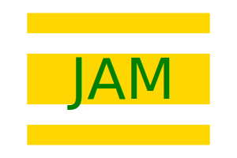
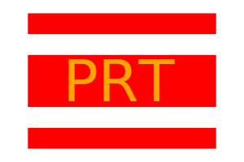
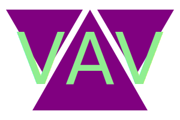
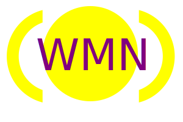

# SVG logo maker from CLI

Creates an SVG logo from CLI user input

## Description

This app allows you to create your own svg logo so you can use it for all your web applications without worring about size and resolution.

## Installation

To install all the dependencies <pre><code>npm i</code></pre>
To run the app <pre><code>node index.js</code></pre> 
and follow all the prompts

## Usage

Logo has 4 shape options:
- Circles
- Triangles
- Squares
- Rectangules

And users can only add from 0 to 3 letters maximum

## Tests

You can run test by runing the following commands:
<pre><code>npm run test</code></pre>

## Examples

## Demo Video

https://drive.google.com/file/d/1Q_k1HD6cQp0uNNfkcPj8Ue4T_5Xkncon/view